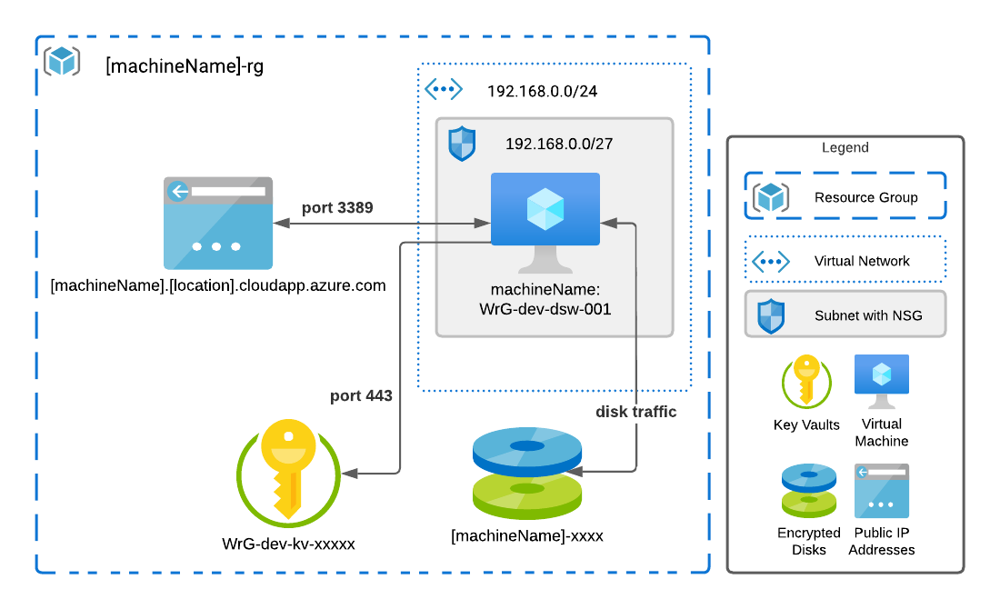

# wrg-terraform-vm-data-science-windows
A data science workstation built from the Microsoft DSVM using terraform

## Getting Started
1. This project is expects resources created by [wrg-terraform-azure-bootstrap](https://github.com/westridgegroup/wrg-terraform-azure-bootstrap) project's TerraformAzureBootstrap.sh script to exist.	
2. From bash shell: az login (make sure you are in the correct subscription)
3. From bash shell: source .wrg/TerraformAzureBootstrap.sh -f ./env/dev-example.tfvars
4. From bash shell: terraform plan -var-file=./env/dev-example.tfvars -out tfplan	
5. From bash shell: terrform apply tfplan

Notes: This project follows the standard WrG terraform famework, state container name and state key information is in the tfvars file. 
Notes: The user_groups variable is read at execution time to populate the access control policy